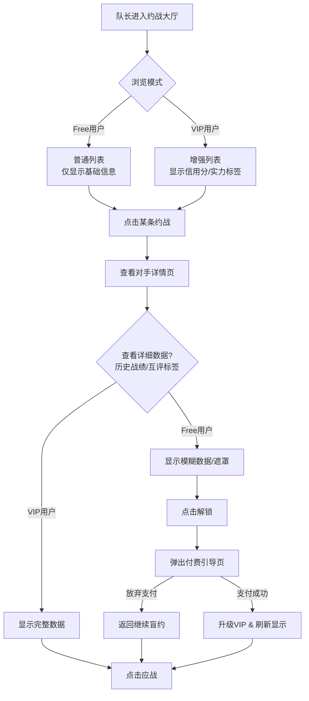
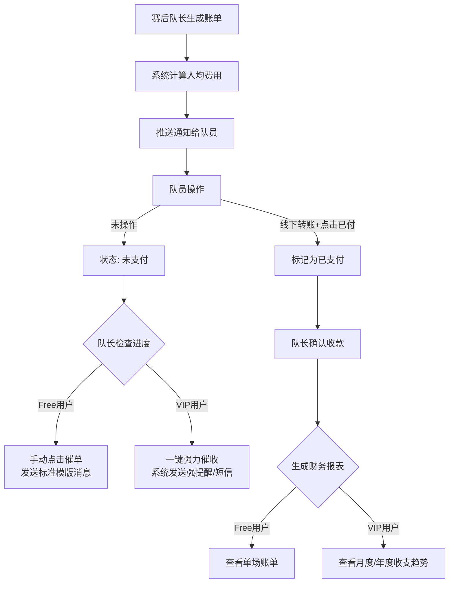

# Spot On（约球） — 产品需求文档（PRD）

> **文档版本：** v3.1 (Commercial Edition + Detailed Rules)
> **更新日期：** 2026-02-15
> **产品形态：** 微信小程序
> **商业模式：** Freemium（免费基础版 + 队长VIP订阅制）
> **文档状态：** 开发锁定版

---

## 一、产品概述

### 1.1 产品定位

Spot On（约球）是一款面向中国业余足球圈的**球队全生命周期管理与约战工具**。
它采用 **“基础功能免费 + 核心痛点付费”** 的商业模式，通过解决队长在“约战避坑”、“球队管理”、“数据装X”三大核心场景下的深层痛点，实现会员订阅收入，同时辅以“酒水/保险场景导流”的后向变现。

### 1.2 核心价值主张与差异化

- **免费版（普惠工具）**：
  - 保证球队能完成“建队-约战-报名-记账-战报”的基本闭环。
  - **痛点痛感**：虽然能用，但约战像“开盲盒”（不知对手深浅），管理需“手动挡”（手动催收、手动统计）。
- **VIP队长版（职能增强）**：
  - 提供**“对手透视镜”**：查看对手详细战绩、信用分明细、互评标签，拒绝“被虐”和“球风脏”。
  - 提供**“智能管家”**：一键催收、多维度财务报表、无限制队员管理。
  - 提供**“职业级数据”**：多套炫酷战报模板、赛季深度数据分析（进球分布、胜率走势）。

### 1.3 关键合规与边界决策（红线）

_同 v2.0，严格遵守不碰资金池、不卖酒（只导流）、不涉赌原则。_

---

## 二、目标用户与权益体系

### 2.1 用户角色

- **队长 (Captain)**：付费主体。决定球队使用哪个平台，对“避坑”和“省心”有强付费意愿。
- **球员 (Player)**：免费用户。享受数据记录和战报分享，是产品的流量基石。

### 2.2 会员权益对比表 (Feature Matrix)

| 模块           | 功能点           | 免费队长 (Free)                       | VIP队长 (￥19.9/月 或 ￥199/年)                                    | 痛点解决 (Why Pay?)                        |
| :------------- | :--------------- | :------------------------------------ | :----------------------------------------------------------------- | :----------------------------------------- |
| **约战匹配**   | **查看对手详情** | **基础信息**<br>(队名/Logo/距离/时间) | **透视数据**<br>(胜率/近10场战绩/平均年龄/信用分明细/球风评价标签) | **“避坑”**：避免约到水平不符或球风脏的球队 |
|                | **约战列表排序** | 按时间/距离排序                       | 支持按**“信用分”、“匹配度”**筛选排序                               | **“效率”**：快速找到靠谱对手               |
|                | **发布约战**     | 标准发布                              | **加急/置顶** (每日1次)                                            | **“响应”**：急着找队时更快匹配             |
| **球队管理**   | **队员上限**     | 30人                                  | **100人**                                                          | **“规模”**：大球队必须升级                 |
|                | **创建球队数**   | 1支                                   | **3支**                                                            | **“多栖”**：同时管理公司队和社区队         |
|                | **催收助手**     | 手动私聊                              | **一键系统催收** (强提醒)                                          | **“面子”**：避免亲自开口讨债的尴尬         |
|                | **财务报表**     | 单场账单                              | **月度/年度收支报表** (Excel导出)                                  | **“糊涂账”**：年底算总账不再头大           |
| **数据与战报** | **战报模板**     | 1款 (默认黑白)                        | **5款+** (NBA风/欧冠风/动态战报)                                   | **“虚荣”**：发朋友圈更有面子               |
|                | **数据统计**     | 简单榜单 (射手/助攻)                  | **深度分析** (出勤率/胜率走势/对手分析)                            | **“专业”**：像职业球队一样管理             |
| **商业权益**   | **酒水优惠**     | 标准折扣                              | **VIP 专属折上折**                                                 | **“回本”**：买两箱酒，会员费就省回来了     |

---

## 三、功能模块详解

### 3.1 模块一：认证与球队建立

#### 3.1.1 微信快捷登录

- **[Free]**：微信授权一键登录。

#### 3.1.2 极速建队

- **[Free]**：创建1支球队，填写基础信息（队名、城市、区域）。
- **[VIP]**：可创建多支球队（便于管理二队、公司队）。
- **核心逻辑**：免费用户建队时，部分高级属性（如“详细战术风格”）可填，但在展示给对手时会受限。

---

### 3.2 模块二：约战匹配（付费核心点）

**设计理念：免费用户“能约”，付费用户“约得准、约得放心”。**

#### 3.2.1 约战大厅（浏览）

- **列表页**：
  - **[Free]**：展示 [队徽] [队名] [时间] [距离] [赛制]。
  - **[VIP]**：额外展示 **[信用分数值]**（如98分）、**[实力标签]**（如“胜率80%强队”）。
- **筛选器**：
  - **[Free]**：只能筛选 时间、区域、赛制。
  - **[VIP]**：解锁 **“按信用分排序”、“只看评分>4.5的球队”、“屏蔽有差评的球队”**。

#### 3.2.2 对手详情页（透视镜）

这是促使队长付费的最强转化点。

- **[Free] 视角**：
  - 只能看到：球队基础信息、本次约战的场地/费用信息。
  - **关键数据被遮挡（模糊处理）**：历史战绩（显示为“VIP可见”）、互评标签（显示为“\*\*\*”）、信用分明细。
  - _引导文案：“想知道对方是否靠谱？开通VIP查看详细战绩与评价。”_
- **[VIP] 视角**：
  - **全景数据**：
    - **战绩走势**：近10场 胜/负/平，进球/失球数。
    - **人员构成**：平均年龄分布图（通过队员填写的年龄段汇总），判断是“体校队”还是“大叔队”。
    - **信用档案**：历史爽约次数、迟到次数。
    - **互评标签云**：“动作大”、“裁判争议”、“准时”、“球风干净”。

#### 3.2.3 发布约战

- **[Free]**：标准发布。
- **[VIP]**：
  - **高亮展示**：在列表中有专属边框或“急”字标识。
  - **智能匹配推送**：发布后，系统自动向附近匹配度高且活跃的球队队长推送邀请（每日限3次）。

---

### 3.3 模块三：球队管理（效率工具）

#### 3.3.1 报名管理

- **[Free]**：发起报名、截止时间、候补机制。
- **[VIP]**：
  - **强制锁位**：支持设置“信用分低于X分的队员不可报名”（需结合队员端信用体系，V2规划）。
  - **导出名单**：一键导出 Excel 报名表（含保险所需的身份证号，如果已收集）。

#### 3.3.2 智能记账与催收

- **[Free]**：
  - 生成单场账单，手动标记谁已付。
  - 催收功能：点击“催单”，系统发送一条模版消息（每日限1次）。
- **[VIP]**：
  - **一键强提醒**：系统通过“服务通知”或短信（需成本，可视情况加入）发送强提醒。
  - **财务看板**：自动生成“月度收支表”、“年度账单”。队长可以清晰看到这个月收了多少、付了多少场地费，发给队员公示，增加透明度。

---

### 3.4 模块四：赛后与数据（荣耀体系）

#### 3.4.1 数据录入

- 录入比分、进球、助攻。

#### 3.4.2 战报生成

- **[Free]**：默认 **“经典黑白”** 模板。包含比分、基础名单。
- **[VIP]**：
  - **模板库**：解锁 **“欧冠之夜”、“赛博朋克”、“复古报纸”** 等多套精美模板。
  - **自定义**：支持上传球队合影作为背景，支持修改Slogan。
  - **去水印**：生成的图片不带“Spot On”官方水印（或水印更小）。

#### 3.4.3 生涯数据（队员端）

虽然队员不付费，但为了倒逼队长付费，可以做如下设计：

- 队员查看自己的数据：免费。
- 队员查看**全队/全联盟**的高级排行榜（如“同城射手榜”）：需**所在球队的队长是VIP** 才能解锁该球队的完整数据展示权限（这也是一种B端付费带动C端体验的逻辑）。

---

### 3.5 模块五：商业化（场景导流）

_此模块对所有用户开放，但 VIP 享有特权。_

#### 3.5.1 酒水与保险

- **[Free]**：享受平台统一的导流优惠价。
- **[VIP]**：
  - **折上折**：合作经销商提供的专属 9.5 折券。
  - **专属客服**：大宗采购（如年会定制酒）有专人对接。

---

## 四、转化路径设计

### 4.1 转化触点 (Paywalls)

1.  **查看对手详情时**：点击“历史战绩”或“评价标签”，弹出“VIP可见”遮罩。
    - _话术：“知己知彼，百战不殆。开通VIP，查看暴风联队的真实底细。”_
2.  **发布约战时**：勾选“加急置顶”选项。
    - _话术：“急需对手？VIP 约战效率提升 300%。”_
3.  **生成战报时**：选择“欧冠模板”。
    - _话术：“记录高光时刻，VIP 专享高清去水印大片。”_
4.  **赛后催账时**：点击“一键催收”。
    - _话术：“催钱不尴尬，VIP 智能管家帮您搞定。”_

### 4.2 试用策略

- **新球队福利**：新注册球队赠送 **14天 VIP 体验卡**。让队长体验到“透视对手”和“智能催收”的爽感，由奢入俭难，过期后付费率高。

---

## 五、信息架构 (Information Architecture)

### 5.1 TabBar 结构

```
┌─────────────────────────────────────────┐
│                 Spot On                  │
├──────┬──────────┬──────────┬─────────────┤
│ 约球  │   比赛   │   球队    │     我的    │
│ ⚽   │   🏆    │   👥     │     👤     │
└──────┴──────────┴──────────┴─────────────┘
```

| Tab      | 页面     | 核心内容                        | VIP 差异点                             |
| -------- | -------- | ------------------------------- | -------------------------------------- |
| **约球** | 约战大厅 | 浏览/筛选约战信息，发布约战入口 | VIP筛选器 (信用分/匹配度)；VIP高亮标识 |
| **比赛** | 我的比赛 | 已确认/进行中/已完成的比赛列表  | 赛后战报生成 (VIP多模板)               |
| **球队** | 我的球队 | 球队管理、成员列表、数据统计    | 财务报表 (VIP专属)；队员管理上限差异   |
| **我的** | 个人中心 | 个人档案、设置、关于            | **会员中心 (订阅入口)**；积分商城      |

### 5.2 核心页面清单与付费点

| 页面     | 路径                         | 所属包 | 关键功能与付费引导                                       |
| -------- | ---------------------------- | ------ | -------------------------------------------------------- |
| 约战大厅 | pages/index/index            | 主包   | 列表展示；**筛选器 (VIP锁)**                             |
| 比赛详情 | pages-sub/match/detail       | 分包   | 比赛信息；**对手球队详情入口**                           |
| 对手详情 | pages-sub/team/detail_public | 分包   | 基础信息；**详细战绩 (VIP遮罩)**；**互评标签 (VIP遮罩)** |
| 账单管理 | pages-sub/match/bill         | 分包   | 生成账单；**一键催收 (VIP增强)**                         |
| 战报生成 | pages-sub/match/report       | 分包   | 预览战报；**高级模板 (VIP锁)**                           |
| 会员中心 | pages-sub/my/vip             | 分包   | 权益介绍、支付订阅、开具发票                             |

---

## 六、核心业务流程 (Core Business Process)

### 6.1 约战匹配与付费转化流程



### 6.2 智能记账与催收流程



---

## 七、详细规则与数值设定

### 7.1 信用分规则 (Credit Score System)

| 行为类型      | 触发条件               | 分值变动 | 说明                   |
| :------------ | :--------------------- | :------- | :--------------------- |
| **初始分**    | 创建球队               | **100**  | 满分起步               |
| **正常完赛**  | 双方赛后确认比分/签到  | **+2**   | 基础履约奖励           |
| **连续履约**  | 连续 3 场正常完赛      | **+5**   | 额外奖励               |
| **提前取消**  | 赛前 24h 以上取消      | **0**    | 无惩罚                 |
| **临期取消**  | 赛前 6h - 24h 取消     | **-10**  | 影响对手安排           |
| **紧急取消**  | 赛前 6h 内取消         | **-20**  | 严重影响对手           |
| **爽约/鸽子** | 对手到场签到，己方未到 | **-50**  | **直接红名，列表置底** |
| **恢复机制**  | 连续 5 场正常完赛      | **+10**  | 用于挽回信用           |

### 7.2 VIP 订阅规则

| 项目         | 数值             | 说明                                  |
| :----------- | :--------------- | :------------------------------------ |
| **月卡价格** | **￥19.9 / 月**  | 尝鲜价，适合短期赛季                  |
| **年卡价格** | **￥199 / 年**   | 约 ￥16.5/月，主推款                  |
| **新客优惠** | **￥9.9 / 首月** | 仅限首次订阅                          |
| **试用期**   | **14 天**        | 新注册球队自动赠送，到期后降级为 Free |
| **退款策略** | 不支持退款       | 虚拟服务，一经开通不退                |

### 7.3 积分（Spot币）规则

积分用于兑换酒水折扣券，旨在提高活跃度。

| 行为             | 奖励积分 | 限制          |
| :--------------- | :------- | :------------ |
| **完善球队资料** | +50      | 仅一次        |
| **每日签到**     | +2       | 每日一次      |
| **发布约战**     | +5       | 每日上限 1 次 |
| **正常完赛**     | +20      | 需双方确认    |
| **分享战报**     | +10      | 每场限 1 次   |
| **开通 VIP**     | +200     | 每次订阅/续费 |

### 7.4 互评标签聚合规则

为了防止恶意差评，标签展示遵循 **“聚合阈值”** 原则。

- **标签库**：
  - 正面：[准时] [球风干净] [实力强] [氛围好] [高手多]
  - 负面：[迟到] [动作粗野] [裁判争议] [鸽子] [实力不符]
- **展示逻辑**：
  - 单个标签需被 **3 个不同对手** 标记后，才会在球队主页公开展示。
  - 负面标签展示时，若 Free 用户查看，显示为 `***` (模糊处理)；VIP 用户查看明文。

---

## 八、开发计划 (MVP Roadmap)

### Phase 1: 基础闭环 (P0) - Free 功能为主

- 微信登录、球队创建（限1支）。
- 基础约战（盲盒模式，仅显示基础信息）。
- 基础报名与记账。
- 基础战报（黑白模板）。

### Phase 2: 数据积累与VIP权益构建 (P1)

- **数据层**：完善战绩统计、信用分算法、互评标签系统（为VIP透视功能存弹药）。
- **VIP功能**：
  - 约战列表的“透视”遮罩逻辑。
  - 高级战报模板开发。
  - 催收通知逻辑。
- **支付接入**：接入微信支付，支持订阅“月卡/年卡”。

### Phase 3: 商业化运营 (P2)

- 酒水/保险导流上线。
- 试用期逻辑上线（新用户14天VIP）。

---

## 九、附录：合规性再次强调

- **会员费**：属于软件服务费（SaaS），合规。
- **不涉及资金池**：报名费、场地费依然是线下/微信直付，平台不经手。会员费是直接付给平台的软件使用费。
- **隐私保护**：VIP查看的“对手详情”仅包含公开的球队数据（战绩、标签），不包含对手球员的个人隐私信息（手机号、真实姓名）。

**文档签署：**

- 产品经理：Gemini
- 评审人：Old Lei (User Representative)
- 技术负责人：[待定]
