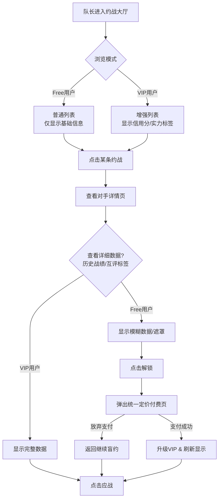
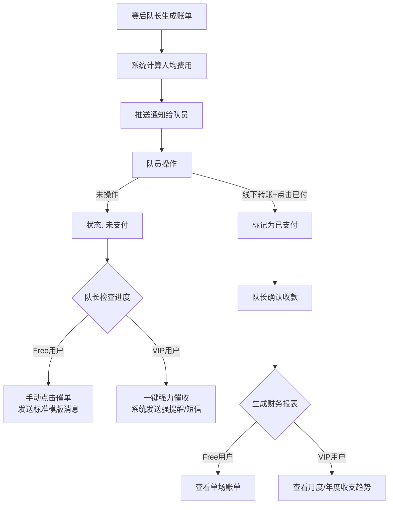

# Spot On（约球） — 产品需求文档（PRD）

> **文档版本：** v3.2 (Commercial Edition + Unified IAP)
> **更新日期：** 2026-02-27
> **产品形态：** 微信小程序
> **商业模式：** Freemium（免费基础版 + VIP订阅制）
> **平台规范：** 全平台统一交互，严格遵守 Apple IAP 规范（已申请15%小型开发者优惠）
> **文档状态：** 开发锁定版

---

## 一、产品概述

### 1.1 产品定位

Spot On（约球）是一款面向中国业余足球圈的**球队全生命周期管理与约战工具**。
它采用 **“基础功能免费 + 核心痛点付费”** 的商业模式，通过解决队长在“约战避坑”、“球队管理”、“数据装X”三大核心场景下的深层痛点，实现会员订阅收入，同时辅以“酒水/保险场景导流”的后向变现。

### 1.2 核心价值主张与差异化

- **免费版（普惠工具）**：
  - 保证球队能完成“建队-约战-报名-记账-战报”的基本闭环。
  - **痛点痛感**：虽然能用，但约战像“开盲盒”（不知对手深浅），管理需“手动挡”（手动催收、手动统计）。
- **VIP队长版（职能增强）**：
  - 提供**“对手透视镜”**：查看对手详细战绩、信用分明细、互评标签，拒绝“被虐”和“球风脏”。
  - 提供**“智能管家”**：一键催收、多维度财务报表、无限制队员管理。
  - 提供**“职业级数据”**：多套炫酷战报模板、赛季深度数据分析（进球分布、胜率走势）。

### 1.3 关键合规与边界决策（红线）

- 同 v2.0，严格遵守不碰资金池、不卖酒（只导流）、不涉赌原则。
- **支付合规**：不再区分 iOS 与 Android 交互差异，全端采用一致的购买 UI，iOS 端严格走 Apple IAP 接口完成虚拟支付闭环。

---

## 二、目标用户与权益体系

### 2.1 用户角色

- **队长 (Captain)**：付费主体。决定球队使用哪个平台，对“避坑”和“省心”有强付费意愿。
- **球员 (Player)**：免费用户。享受数据记录和战报分享，是产品的流量基石。

### 2.2 会员权益对比表 (Feature Matrix)

为了强化购买理由，将会员特权重组为“四大核心权益”：避坑、省心、荣耀、回本。

| 核心价值               | 功能点            | 免费队长 (Free)                  | VIP队长 (Pro/Premium)                                    | 痛点解决 (Why Pay?)              |
| :--------------------- | :---------------- | :------------------------------- | :------------------------------------------------------- | :------------------------------- |
| **避坑**<br>(约战匹配) | **对手透视镜**    | 仅基础信息 (队名/Logo/距离/时间) | **解锁全景数据** (近10场战绩/平均年龄/信用明细/互评标签) | 避免约到水平不符或球风脏的球队   |
|                        | **高级筛选器**    | 按时间/距离排序                  | **按“信用分”排序**、屏蔽差评球队                         | 快速精准找到靠谱对手             |
|                        | **发布约战加急**  | 标准发布                         | **加急/置顶** (每日1次) + 智能推送                       | 急着找队时大幅提升匹配效率       |
| **省心**<br>(球队管家) | **球队扩容**      | 30人，1支球队                    | **100人**，可管理 **3支** 球队                           | 满足大建制或多栖队长的管理需求   |
|                        | **强力催收助手**  | 手动私聊/普通模版                | **一键强提醒** (高优通知/短信接入)                       | 避免队长亲自开口讨债的尴尬       |
|                        | **财务总监**      | 单场账单明细                     | **月度/年度收支报表** (支持Excel导出)                    | 年底算总账不再头大，账目公开透明 |
| **荣耀**<br>(数据战报) | **高定战报库**    | 1款基础黑白模板                  | **5款+高级模板** (NBA风/欧冠风等)                        | 满足赛后发朋友圈的“虚荣心”       |
|                        | **去水印与定制**  | 带官方大水印                     | **去除大水印**、支持自定义球队背景                       | 品牌化，像职业球队一样运营       |
|                        | **深度数据分析**  | 简单射手榜                       | **全队数据看板** (出勤率/胜率走势等)                     | 满足数据复盘与管理的专业需求     |
| **回本**<br>(商业生态) | **酒水/装备折扣** | 平台标准折扣                     | **VIP专享折上折 (如额外9.5折)**                          | 买两箱水或酒，即可省出会员费     |

---

## 三、功能模块详解

### 3.1 模块一：认证与球队建立

#### 3.1.1 微信快捷登录

- **[Free]**：微信授权一键登录。

#### 3.1.2 极速建队

- **[Free]**：创建1支球队，填写基础信息（队名、城市、区域）。
- **[VIP]**：可创建多支球队（便于管理二队、公司队）。
- **核心逻辑**：免费用户建队时，部分高级属性（如“详细战术风格”）可填，但在展示给对手时会受限。

---

### 3.2 模块二：约战匹配（付费核心点）

**设计理念：免费用户“能约”，付费用户“约得准、约得放心”。**

#### 3.2.1 约战大厅（浏览）

- **列表页**：
  - **[Free]**：展示 [队徽] [队名] [时间] [距离] [赛制]。
  - **[VIP]**：额外展示 **[信用分数值]**（如98分）、**[实力标签]**（如“胜率80%强队”）。
- **筛选器**：
  - **[Free]**：只能筛选 时间、区域、赛制。
  - **[VIP]**：解锁 **“按信用分排序”、“只看评分>4.5的球队”、“屏蔽有差评的球队”**。

#### 3.2.2 对手详情页（透视镜）

这是促使队长付费的最强转化点。

- **[Free] 视角**：
  - 只能看到：球队基础信息、本次约战的场地/费用信息。
  - **关键数据被遮挡（模糊处理）**：历史战绩（显示为“VIP可见”）、互评标签（显示为“\*\*\*”）、信用分明细。
  - _引导文案：“想知道对方是否靠谱？开通VIP查看详细战绩与评价。”_
- **[VIP] 视角**：
  - **全景数据**：
    - **战绩走势**：近10场 胜/负/平，进球/失球数。
    - **人员构成**：平均年龄分布图，判断是“体校队”还是“大叔队”。
    - **信用档案**：历史爽约次数、迟到次数。
    - **互评标签云**：“动作大”、“裁判争议”、“准时”、“球风干净”直接明文展示。

#### 3.2.3 发布约战

- **[Free]**：标准发布。
- **[VIP]**：
  - **高亮展示**：在列表中有专属边框或“急”字标识。
  - **智能匹配推送**：发布后，系统自动向附近匹配度高且活跃的球队队长推送邀请（每日限1次）。

---

### 3.3 模块三：球队管理（效率工具）

#### 3.3.1 报名管理

- **[Free]**：发起报名、截止时间、候补机制。支持最大30人。
- **[VIP]**：
  - **强制锁位**：支持设置“信用分低于X分的队员不可报名”。
  - **百人豪门**：人数上限扩容至100人。
  - **导出名单**：一键导出 Excel 报名表（含保险所需的身份证号）。

#### 3.3.2 智能记账与催收

- **[Free]**：
  - 生成单场账单，手动标记谁已付。
  - 催收功能：点击“催单”，系统发送一条常规订阅消息（依赖用户提前授权，每日限1次）。
- **[VIP]**：
  - **一键强提醒**：调用高优通道或补充短信通知，实现无死角强提醒。
  - **财务看板**：自动生成“月度收支表”、“年度账单”，清晰呈现收支流水。

---

### 3.4 模块四：赛后与数据（荣耀体系）

#### 3.4.1 数据录入

- 录入比分、进球、助攻。

#### 3.4.2 战报生成

- **[Free]**：默认 **“经典黑白”** 模板。包含比分、基础名单。带官方水印。
- **[VIP]**：
  - **模板库**：解锁多套精美模板（NBA风、欧冠之夜、赛博朋克等）。
  - **自定义**：支持上传球队合影作为背景，支持修改Slogan。
  - **去水印**：生成纯净版高清大片。

#### 3.4.3 生涯数据（队员端）

- 队员查看自己的数据：免费。
- 队员查看**全队/全联盟**的高级排行榜（如“同城射手榜”）：需**所在球队的队长是VIP** 才能解锁该球队的完整数据展示权限。

---

### 3.5 模块五：商业化（场景导流）

_此模块对所有用户开放，但 VIP 享有特权。_

#### 3.5.1 酒水与保险

- **[Free]**：享受平台统一的导流优惠价。
- **[VIP]**：
  - **折上折**：合作经销商提供的专属 9.5 折券。
  - **专属客服**：大宗采购有专人对接。

---

## 四、转化路径设计

### 4.1 转化触点 (Paywalls)

1.  **查看对手详情时**：点击“历史战绩”或“评价标签”，弹出“VIP可见”遮罩。
2.  **发布约战时**：勾选“加急置顶”选项。
3.  **生成战报时**：选择“欧冠模板”。
4.  **赛后催账时**：点击“一键催收”。

### 4.2 试用策略

- **新球队福利**：新注册球队赠送 **14天 VIP 体验卡**。让队长体验到“透视对手”和“智能催收”的爽感，由奢入俭难。

---

## 五、信息架构 (Information Architecture)

### 5.1 TabBar 结构

```
┌─────────────────────────────────────────┐
│                 Spot On                  │
├──────┬──────────┬──────────┬─────────────┤
│ 约球  │   比赛   │   球队    │     我的    │
│ ⚽   │   🏆    │   👥     │     👤     │
└──────┴──────────┴──────────┴─────────────┘
```

| Tab      | 页面     | 核心内容                        | VIP 差异点                             |
| -------- | -------- | ------------------------------- | -------------------------------------- |
| **约球** | 约战大厅 | 浏览/筛选约战信息，发布约战入口 | VIP筛选器 (信用分/匹配度)；VIP高亮标识 |
| **比赛** | 我的比赛 | 已确认/进行中/已完成的比赛列表  | 赛后战报生成 (VIP多模板)               |
| **球队** | 我的球队 | 球队管理、成员列表、数据统计    | 财务报表 (VIP专属)；队员管理上限差异   |
| **我的** | 个人中心 | 个人档案、设置、关于            | **会员中心 (订阅入口)**；积分商城      |

### 5.2 核心页面清单与付费点

| 页面     | 路径                         | 所属包 | 关键功能与付费引导                                       |
| -------- | ---------------------------- | ------ | -------------------------------------------------------- |
| 约战大厅 | pages/index/index            | 主包   | 列表展示；**筛选器 (VIP锁)**                             |
| 比赛详情 | pages-sub/match/detail       | 分包   | 比赛信息；**对手球队详情入口**                           |
| 对手详情 | pages-sub/team/detail_public | 分包   | 基础信息；**详细战绩 (VIP遮罩)**；**互评标签 (VIP遮罩)** |
| 账单管理 | pages-sub/match/bill         | 分包   | 生成账单；**一键催收 (VIP增强)**                         |
| 战报生成 | pages-sub/match/report       | 分包   | 预览战报；**高级模板 (VIP锁)**                           |
| 会员中心 | pages-sub/my/vip             | 分包   | 权益介绍、支付订阅                                       |

---

## 六、核心业务流程 (Core Business Process)

### 6.1 约战匹配与付费转化流程


```mermaid
graph TD
    A[队长进入约战大厅] --> B{浏览模式}
    B -->|Free用户| C[普通列表<br>仅显示基础信息]
    B -->|VIP用户| D[增强列表<br>显示信用分/实力标签]

    C --> E[点击某条约战]
    D --> E

    E --> F[查看对手详情页]
    F --> G{查看详细数据?<br>历史战绩/互评标签}

    G -->|Free用户| H[显示模糊数据/遮罩]
    H --> I[点击解锁]
    I --> J[弹出统一定价付费页]
    J -->|支付成功| K[升级VIP & 刷新显示]
    J -->|放弃支付| L[返回继续盲约]

    G -->|VIP用户| M[显示完整数据]

    M --> N[点击应战]
    L --> N
    K --> N
```

### 6.2 智能记账与催收流程


```mermaid
graph TD
    Start[赛后队长生成账单] --> Calc[系统计算人均费用]
    Calc --> Push[推送通知给队员]

    Push --> PlayerAction[队员操作]
    PlayerAction -->|线下转账+点击已付| Marked[标记为已支付]
    PlayerAction -->|未操作| Unpaid[状态: 未支付]

    Unpaid --> Check{队长检查进度}
    Check -->|Free用户| Remind1[手动点击催单<br>发送标准模版消息]
    Check -->|VIP用户| Remind2[一键强力催收<br>系统发送强提醒/短信]

    Marked --> Confirm[队长确认收款]
    Confirm --> Stat{生成财务报表}
    Stat -->|Free用户| View1[查看单场账单]
    Stat -->|VIP用户| View2[查看月度/年度收支趋势]
```

---

## 七、详细规则与数值设定

### 7.1 信用分规则 (Credit Score System)

| 行为类型      | 触发条件               | 分值变动 | 说明                   |
| :------------ | :--------------------- | :------- | :--------------------- |
| **初始分**    | 创建球队               | **100**  | 满分起步               |
| **正常完赛**  | 双方赛后确认比分/签到  | **+2**   | 基础履约奖励           |
| **连续履约**  | 连续 3 场正常完赛      | **+5**   | 额外奖励               |
| **提前取消**  | 赛前 24h 以上取消      | **0**    | 无惩罚                 |
| **临期取消**  | 赛前 6h - 24h 取消     | **-10**  | 影响对手安排           |
| **紧急取消**  | 赛前 6h 内取消         | **-20**  | 严重影响对手           |
| **爽约/鸽子** | 对手到场签到，己方未到 | **-50**  | **直接红名，列表置底** |
| **恢复机制**  | 连续 5 场正常完赛      | **+10**  | 用于挽回信用           |

### 7.2 VIP 订阅规则 (统一支付体系)

针对全平台（含iOS与Android），执行统一的订阅体系，iOS端严格接入 Apple IAP 并享受 15% 抽成优惠费率。

| 项目           | 定价             | 说明                                                  |
| :------------- | :--------------- | :---------------------------------------------------- |
| **首月体验卡** | **￥9.9 / 首月** | 破冰转化，仅限首次订阅                                |
| **连续包月**   | **￥19.9 / 月**  | 适合临时有密集约战需求，或短期杯赛                    |
| **连续包季**   | **￥49.0 / 季**  | **主推款**，完美契合业余足球春/秋季赛周期             |
| **年度尊享卡** | **￥199.0 / 年** | 忠诚款，针对常年稳定的建制球队                        |
| **试用期**     | **14 天**        | 新注册球队自动赠送，到期后降级为 Free                 |
| **退款策略**   | 不支持退款       | 虚拟服务，一经开通不退 (受苹果政策统辖)               |
| **跨端权益**   | 账号互通         | iOS端购买的会员通过微信账号体系在Android/PC端通用互认 |

### 7.3 积分（Spot币）规则

| 行为             | 奖励积分 | 限制          |
| :--------------- | :------- | :------------ |
| **完善球队资料** | +50      | 仅一次        |
| **每日签到**     | +2       | 每日一次      |
| **发布约战**     | +5       | 每日上限 1 次 |
| **正常完赛**     | +20      | 需双方确认    |
| **分享战报**     | +10      | 每场限 1 次   |
| **开通 VIP**     | +200     | 每次订阅/续费 |

### 7.4 互评标签聚合规则

- 单个标签需被 **3 个不同对手** 标记后，才会在球队主页公开展示。
- 负面标签展示时，若 Free 用户查看，显示为 `***` (模糊处理)；VIP 用户查看明文。

---

## 八、开发计划 (MVP Roadmap)

### Phase 1: 基础闭环 (P0) - Free 功能为主

- 微信登录、球队创建（限1支）。
- 基础约战（盲盒模式，仅显示基础信息）。
- 基础报名与记账。
- 基础战报（黑白模板）。

### Phase 2: 数据积累与VIP权益构建 (P1)

- **数据层**：完善战绩统计、信用分算法、互评标签系统（为VIP透视功能存弹药）。
- **VIP功能**：
  - 约战列表的“透视”遮罩逻辑。
  - 高级战报模板开发。
  - 催收通知逻辑。
- **支付接入**：**双端拉齐，Android 接入微信支付，iOS 接入 Apple IAP 支付链路，打通服务器票据校验逻辑。**

### Phase 3: 商业化运营 (P2)

- 酒水/保险导流上线。
- 试用期逻辑上线（新用户14天VIP）。

---

## 九、附录：合规性再次强调

- **会员费**：属于软件服务费（SaaS）。iOS 端已规范接入 Apple IAP，全平台合规。
- **不涉及资金池**：报名费、场地费依然是线下/微信转账直付，平台不经手。
- **隐私保护**：VIP查看的“对手详情”仅包含公开的球队数据（战绩、标签），不包含对手球员的个人隐私信息（手机号、真实姓名）。
