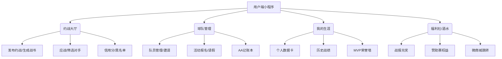

# Spot On (约球) — 产品需求文档 (PRD_gemini)

> **版本**：v1.0 (Gemini Revision)
> **日期**：2026-02-15
> **视角**：基于资深PM视角的最终修订版
> **状态**：**开发锁定版**

---

## 第一部分：Gemini 的产品洞察与策略调整

在阅读了《用户调研》、《PRD》及《PRD_codex》后，我作为产品经理补充以下关键视角。特别是针对**“运营团队本身即为酒类经销商”**这一核心优势，我们需要调整商业化策略的激进程度。

### 1. 商业化策略升级：从“导流”转为“生态融合”
前两版PRD将酒水业务视为“广告位”或“推荐卡”，这浪费了“自营”的优势。
*   **调整点**：建立 **“踢球赚酒（Match-to-Drink）”** 的激励循环。
*   **逻辑**：用户使用小程序的核心行为（发布约战、录入战报、确认比分）产出“积分”或“勋章”，这些虚拟资产可直接在经销商商城（关联小程序）兑换大额折扣券或实物酒水。
*   **价值**：既解决了SaaS工具变现难的问题，又解决了酒水销售获客成本高的问题。每一个战报的提交，都是一次潜在的酒水复购。

### 2. 增长策略：社交货币的具象化 —— “约战书”
老雷提到的“虚荣心”不应只在赛后战报，更应在赛前。
*   **新增功能**：**生成“约战书”**。
*   **描述**：仿照职业拳击或古代战书的视觉风格，包含时间、地点、赌注（如“输了买水”）、球队Slogan。
*   **场景**：队长生成图片/小程序卡片 -> 转发至微信群/朋友圈 -> 对手扫码应战。这是冷启动最强的病毒传播抓手。

### 3. 体验优化：极简主义的“管钱”与“记分”
*   **管钱**：彻底放弃“支付”与“对账”的强耦合。采用**“记账本”模式**。队长只需记一笔“应收”，队员点击“我已付”，队长划勾确认。不涉及资金流，完全规避合规风险，且符合熟人社交的信任底色。
*   **记分**：支持**“模糊录入”**。如果队长懒得分配进球，直接确认总比分即可完赛。不要因为追求数据完美而阻碍流程闭环。

---

## 第二部分：详细产品需求文档 (PRD)

### 1. 产品综述

#### 1.1 产品定位
一款基于微信小程序的业余足球球队全生命周期管理工具。以**“约战匹配”**为切入点，以**“球队管理”**为留存手段，以**“酒水权益”**为商业化核心。

#### 1.2 核心用户画像
*   **队长（核心付费/决策者）**：30-45岁男性，痛点是组局累、收钱尴尬、找不到靠谱对手。
*   **队员（流量基数）**：关注个人数据（进球/助攻）、MVP荣誉、赛后聚餐。

---

### 2. 业务架构图

---

### 3. 功能模块详解

#### 模块一：球队与认证 (Team & Auth)

**3.1.1 极速创建**
*   **逻辑**：微信授权一键登录。创建球队仅需：队名、城市、常驻区域。
*   **亮点**：
    *   **默认配置**：系统预设“默认队徽”、“默认口号”，降低门槛。
    *   **队规设置**：预设“迟到罚款”、“鸽子踢出”等选项，队长勾选即可生成“入队协议”。

**3.1.2 队员邀请**
*   **机制**：生成“招募海报”或小程序卡片。
*   **参数**：扫描卡片自动申请加入该队。

#### 模块二：约战系统 (Matchmaking) —— 核心增长点

**3.2.1 发布约战**
*   **核心字段**：时间、球场（支持模糊位置）、赛制（5/7/11人）、**费用分摊方式**（AA/输家付/主队包）、**球衣颜色**。
*   **Gemini补充**：**“酒水彩头”**（非强制）。勾选“赛后聚餐局”，系统自动标记该局具有高潜消费力，匹配同样喜欢聚餐的球队。

**3.2.2 约战书 (The Challenge Letter)**
*   **功能**：发布约战后，自动生成一张视觉冲击力强的图片。
*   **文案模板**：
    *   *“周四晚8点，奥体中心，谁敢来战？”*
    *   *“暴风联队摆擂，输了请喝酒！”*
*   **交互**：点击图片/卡片上的“应战”按钮，直接跳转小程序应战页面。

**3.2.3 匹配筛选**
*   **硬指标**：信用分（低于80分折叠显示）。
*   **软指标**：平均年龄（防止“大叔队”遇到“体校队”）。

#### 模块三：赛事执行与管理 (Execution)

**3.3.1 报名锁位**
*   **功能**：队长发起报名，设置名额上限。
*   **候补机制**：满员后自动进入候补，有人退出自动替补通知。
*   **外援通道**：允许队长手动添加“临时外援”（非注册用户），确保名单完整。

**3.3.2 极简AA账本**
*   **痛点解法**：不碰资金流。
*   **流程**：
    1.  队长设置总金额（如场地800元），勾选参与分摊人数（如10人）。
    2.  系统计算：每人80元。
    3.  推送账单给队员。
    4.  队员线下/微信转账后，点击**“我已付”**。
    5.  队长收到通知，点击**“确认收到”**。
    6.  **催单**：对未标记的队员，一键发送“系统催单”通知（避免队长尴尬）。

#### 模块四：赛后结算与数据 (Post-Match)

**3.4.1 比分握手**
*   **逻辑**：主队提交比分 -> 客队确认。
*   **争议处理**：若客队拒绝确认，进入“争议状态”，不计入胜率，但记录一次“争议”。

**3.4.2 数据录入 (Data Entry)**
*   **分层录入**：
    *   L1（极简）：仅录入比分。
    *   L2（标准）：录入进球者、助攻者。
    *   L3（详尽）：录入MVP、红黄牌。
*   **Gemini建议**：默认L2，允许降级到L1。

**3.4.3 战报生成**
*   **样式**：NBA风格战报图。
*   **内容**：比分、MVP大头照、进球名单、赞助商Logo（酒水品牌植入）。

#### 模块五：商业化闭环 (Commercialization - Alcohol)

由于运营方是酒商，商业化应无缝植入，而非生硬广告。

**3.5.1 “第三半场”赞助计划**
*   **入口**：首页Banner / 个人中心“福利”。
*   **机制**：
    *   **认证礼**：球队完成认证，送“新人见面酒”（需付运费或到店自提）。
    *   **战报礼**：每上传一场有效战报（双方确认），全队获得“50元酒水券”。
    *   **连胜礼**：3连胜球队，奖励一箱定制啤酒（限量引流）。

**3.5.2 赢球彩头 (The Bet)**
*   **场景**：约战时勾选“输了买水”。
*   **履约**：赛后结算页，直接弹出“一键买单”按钮，跳转至关联的酒水商城小程序，地址自动定位到当前球场或周边合作餐厅。

**3.5.3 球队定制酒 (Customization)**
*   **服务**：提供瓶身贴纸定制服务（队徽、队名、口号）。
*   **门槛**：无需大批量，小程序内直接通过“设计工具”预览效果，一箱起订。

---

### 4. 微信小程序合规与限制应对

| 限制项 | 应对方案 |
| :--- | :--- |
| **资金池风险** | 放弃“预充值/队费余额”功能。采用“记账本+线下转账”模式。 |
| **诱导分享** | “约战书”通过生成图片分享，而非强制转发才能解锁功能。 |
| **推送限制** | 核心流程（报名、账单、比分）采用“订阅消息”。在首次报名时引导用户勾选“总是保持选择”。 |
| **酒类销售** | Spot On小程序只做**权益展示与积分兑换**，实际交易跳转至**已备案的酒类销售主体小程序**。 |

---

### 5. 数据埋点与运营指标 (KPI)

*   **北极星指标**：**周活跃球队数 (Active Teams Per Week)** —— 定义为本周至少完成一次“报名-完赛-记分”闭环的球队。
*   **商业化指标**：**战报转化率** —— (通过战报/福利页跳转酒水商城的次数) / (总战报生成数)。

---

### 6. 开发优先级 (MVP Roadmap)

**P0 (必须有)**：
1.  球队创建/加入。
2.  约战发布与大厅列表。
3.  报名接龙（含候补）。
4.  赛后比分确认（仅比分）。
5.  基础AA记账。

**P1 (应该有)**：
1.  “约战书”图片生成。
2.  进球/助攻详细录入。
3.  个人数据页（进球/助攻/MVP）。
4.  酒水福利页（静态展示）。

**P2 (可以有)**：
1.  定制酒设计工具。
2.  互评标签系统。
3.  多队管理切换。

---
